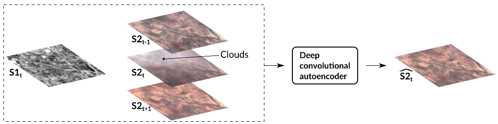

Deep-Gapfill
======

Official implementation of **Optical image gap filling using deep convolutional autoencoder from optical and radar images** presented at __IGARSS 2019__.

R. Cresson<sup>a</sup> , D. Ienco<sup>a</sup> , R. Gaetano<sup>b</sup> , K. Ose<sup>a</sup> , D. Ho Tong Minh<sup>a</sup>  
a: _IRSTEA, UMR TETIS, University of Montpellier, France_  
b: _CIRAD, UMR TETIS, University of Montpellier, France_



# Dependencies

* [The Orfeo ToolBox](https://www.orfeo-toolbox.org/) (OTB)
* [TensorFlow](https://www.tensorflow.org/)
* [OTBTF](https://github.com/remicres/otbtf) remote module of OTB (can be built without TensorFlow support, but you would be able only to train the model, not to generate images with **TensorflowModelServe** or fine-tune an existing SavedModel with **TensorflowModelTrain**.)

# How to install it

The easiest way is to use [the dockerfile of OTBTF](https://github.com/remicres/otbtf/tree/master/tools/dockerfiles) since compiling OTB+TensorFlow takes some time.  
[Build the docker image](https://www.google.com/search?q=how+to+build+docker+image+from+dockerfile), then just enter the docker and clone this repository.

# How to use it

Let's explain a bit how you can use Deep-Gapfill

## Step 1. Normalize the input images

Use the OTB application **ComputeImagesStatistics**, or **gdalinfo -stats** (or whatever your favorite stats application is) to compute some stats of your input images.
These statistics will be used to rescale your input images between 0 and 1.
Keep the values somewhere, because later you will need them to denormalize the output images.
The **BandMathX** OTB application is nice to perform the rescaling.
Note that the input images must be resampled at the same resolution.

### Step 2. Patches selection

You can use QGIS for that. The goal is to use the images clouds masks to select where you want to use training patches and validation patches.
In the end you should have two vector data files (one for training  __patches_train.shp__, and one for validation __patches_valid.shp__) containing points centered on the patches you want to use.
The **grid**, **centroids** and **Random selection** tools from QGIS are your friends here. Be careful with no-data values! Patches should not contain any no-data pixel.

### Step 3. Patches extraction

Use the OTBTF **PatchesExtraction** application to extract patches in the images.
First, tell **OTBTF** that you need 4 sources (one for SAR: _s1t_, and three for optical images: _s2t-1_,_s2t_,_s2t+1_).

```
export OTB_TF_NSOURCES=3
```

Then run **PatchesExtraction** with $s1t, $s2t, $s2tA and $s2tB corresponding to your normalized images.
The following shows the command line for the training dataset.

```
otbcli_PatchesExtraction \
-source1.il $s1t -source1.patchsizex 64 -source1.patchsizey 64 -source1.out /data/patches/training/s1.tif \
-source2.il $s2t -source2.patchsizex 64 -source2.patchsizey 64 -source2.out /data/patches/training/im1.tif \
-source3.il $s2tA -source3.patchsizex 64 -source3.patchsizey 64 -source3.out /data/patches/training/im2.tif \
-source4.il $s2tB -source4.patchsizex 64 -source4.patchsizey 64 -source4.out /data/patches/training/im3.tif \
-vec /data/vector/patches_train.shp -field "fid" # Or whatever existing field there is... you need to put one existing field. I'll correct this issue soon.
```

Do the same for validation dataset.

```
otbcli_PatchesExtraction \
-source1.il $s1t -source1.patchsizex 64 -source1.patchsizey 64 -source1.out /data/patches/validation/s1.tif \
-source2.il $s2t -source2.patchsizex 64 -source2.patchsizey 64 -source2.out /data/patches/validation/im1.tif \
-source3.il $s2tA -source3.patchsizex 64 -source3.patchsizey 64 -source3.out /data/patches/validation/im2.tif \
-source4.il $s2tB -source4.patchsizex 64 -source4.patchsizey 64 -source4.out /data/patches/validation/im3.tif \
-vec /data/vector/patches_valid.shp -field "fid" 
```

### Step 4. Train your model

Now use the script provided to build and train the model.

```
python /path/to/deep-gapfill/model.py \
  --s1_t               /data/patches/training/s1.tif   \
  --s2_t_before       /data/patches/training/im1.tif   \
  --s2_t              /data/patches/training/im2.tif   \
  --s2_t_after        /data/patches/training/im3.tif   \
  --valid_s1_t        /data/patches/validation/s1.tif  \
  --valid_s2_t_before /data/patches/validation/im1.tif \
  --valid_s2_t        /data/patches/validation/im2.tif \
  --valid_s2_t_after  /data/patches/validation/im3.tif \
  --logdir /data/logs/gapfill_log --save_ckpt /data/ckpts/gapfill_model
```

You can use TensorBoard to follow the training and the validation.  
In case the _tricks.py_ is missing, just add to the _PYTHONPATH_ the path of **OTBTF** python directory.

```
tensorboard --logdir /data/logs/
```

Then open yout favorite web browser.

### Step 5. Export a SavedModel

Use **OTBTF**'s **ckpt2savedmodel.py** to convert the checkpoint into a TensorFlow SavedModel.  
Specify what inputs/outputs of the model you need.

```
python /work/otb/otb/Modules/Remote/otbtf/python/ckpt2savedmodel.py \
--ckpt /data/ckpts/gapfill_model-199       \
--inputs "s1:0" "s2_before:0" "s2_after:0" \
--outputs "gen_fcn:0"                      \
--model /data/GapFill_SavedModel
```

Note that you can now use **TensorflowModelTrain** OTBTF application to do the training of the exported SavedModel.

### Step 6. Generate the estimated image

Let's use **TensorflowModelServe** to generate the full optical image.  
The model has a receptive field of 576x576 pixels and an expression field of 64x64 pixels since we use the exact FCN output ("gen_fcn" tensor).

```
otbcli_TensorflowModelServe \
-source1.il $s2tA -source1.placeholder "s2_before" -source1.rfieldx 576 -source1.rfieldy 576 \
-source2.il $s2tB -source2.placeholder "s2_after" -source2.rfieldx 576 -source2.rfieldy 576 \
-source3.il $s1t -source3.placeholder "s1" -source3.rfieldx 576 -source3.rfieldy 576 \
-model.dir /data/GapFill_SavedModel/ -model.fullyconv on \
-output.names "gen_fcn" -output.efieldx 64 -output.efieldy 64 \
-out /data/s2_estimated.tif
```

You can tweak a bit the application to speed ud the process: force the use of large tiles in adding e.g. ` -optim.tilesizex 2048 -optim.tilesizey 2048` to the former command line.

### Step 7. Denormalize the output image

Use **BandMathX** to denormalize the __s2_estimated.tif__ generated image.  
You can also use **BandMathX** to keep non polluted values of the s2t image, and replace the polluted ones with __s2_estimated.tif__.

# Licence

Please see the license for legal issues on the use of the software.

# Contact

You can contact Remi Cresson if you have any issues with this remote module at remi [dot] cresson [at] irstea [dot] fr

